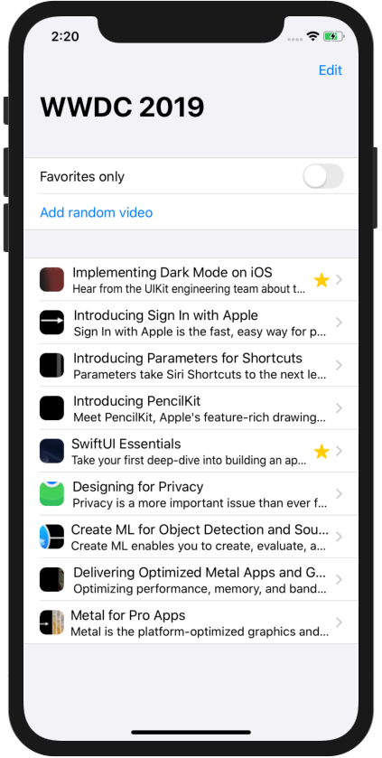

# SwiftUI by Examples

  

  
  

SwiftUI is a simple way to build user interfaces across all Apple platforms with the power of Swift. I'm going to fill the repo with useful examples of SwiftUI. Stay tuned!

  

## Author

Artem Novichkov, novichkoff93@gmail.com

## License

SwiftUI by Examples is available under the MIT license. See the LICENSE file for more info.
